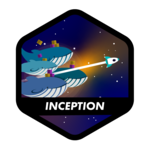
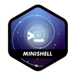

<!--
**Dangerdrive/Dangerdrive** is a ✨ _special_ ✨ repository because its `README.md` (this file) appears on your GitHub profile.

Here are some ideas to get you started:

I am pharmacist that used to work with regulatory affairs and now I am learning how to code. I am currently studying at 42 São Paulo, a coding school that uses the peer-to-peer learning method. I am currently working on push_swap project, a sorting algorithm project that uses two stacks to sort a list of numbers.

-->
# About Me

Hello! I'm [Your Name], a pharmacist transitioning into the world of software development. My journey began in the field of regulatory affairs, where I honed my attention to detail and analytical skills. Now, I'm channeling that experience into coding, embracing the challenges and creativity it offers.

## Transitioning to Tech

I've embarked on a new chapter at 42 São Paulo, a coding school renowned for its peer-to-peer learning method. This environment fosters not just coding proficiency, but also critical thinking and collaborative skills, all of which are invaluable in tech.

## Current Projects

Currently, I'm diving into the intricacies of algorithms with the **push_swap** project. This project is a fantastic exploration of sorting algorithms, where the challenge is to sort a list of numbers using two stacks as efficiently as possible.

Check out my push_swap project here: [push_swap](https://github.com/Dangerdrive/push_swap)
(github.com/Dangerdrive/push_swap)

## Looking Ahead

As I continue to bridge my past experiences with my newfound passion for coding, I'm eager to explore how technology can innovate and streamline fields like healthcare and regulatory affairs. Stay tuned for more projects where I blend my diverse background with programming to create impactful solutions.

---

Feel free to connect with me on GitHub to follow my journey from pharmacy to programming!

## Previous projects from 42 São Paulo:
(github.com/Dangerdrive/piscine)
(github.com/Dangerdrive/libft)
(github.com/Dangerdrive/get_next_line)
(github.com/Dangerdrive/ft_printf)
(github.com/Dangerdrive/born2beroot)
(github.com/Dangerdrive/fract-ol)
(github.com/Dangerdrive/pipex)

<!--

-->